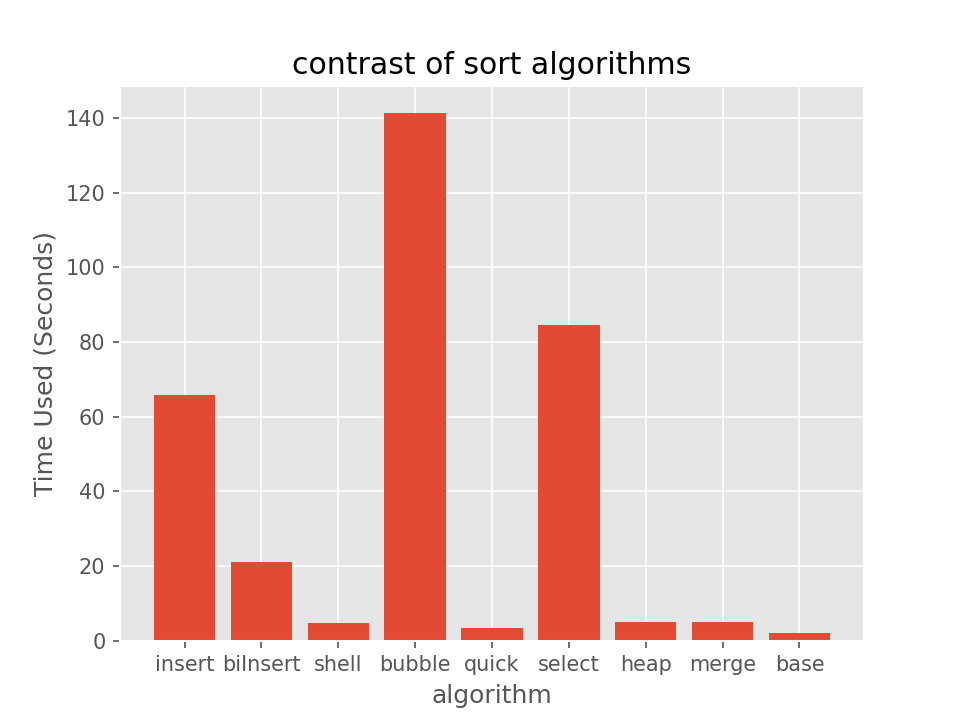

# 专题：排序

主要考察的排序主要有八种排序，它们是：

- 直接插入排序 **基本有序**时适用，算法**稳定**。
- 希尔排序 对较大规模的排序都可以达到很高的效率，但并没有精确的渐进时间。算法**不稳定**
- 冒泡排序 **基本有序**时适用。算法**稳定**，效果与直接插入排序类似，都可以使用**链表**实现。
- 快速排序 元素**随机分布**时效率较好。公认的**平均性能最优**的排序算法 算法**不稳定**
- 简单选择排序 与序列初始状态**无关**，算法**不稳定**
- 堆排序 使用数据结构**堆**来辅助排序，常数级别的空间复杂度，最好、平均、最坏性能均为$O(nlog_2n)$，算法**不稳定**
- 归并排序 分割子序列与初始序列的排列**无关**，且算法**稳定**
- 基数排序 并不适用于所有情况，但其性能有时可以达到**最优**。算法**稳定**

## 算法对比

| algorithm | best | average | worst | space | stable |
| --------- | ---- | ------- | ----- | ----- | ------ |
| <a href="##插入排序">插入排序</a> | $O(n)$ | $O(n^2)$ | $O(n^2)$ | $O(1)$  | ***True*** |
| <a href="##希尔排序">希尔排序</a> | - | - | - | $O(1)$ | ***False*** |
| <a href="##冒泡排序">冒泡排序</a> | $O(n)$ | $O(n^2)$ | $O(n^2)$ | $O(1)$ | ***True*** |
| <a href="##快速排序">快速排序</a> | $O(nlog_2n)$ | $O(nlog_2n)$ | $O(n^2)$ | $O(nlog_2n)$ | ***False*** |
| <a href="##选择排序">选择排序</a> | $O(n^2)$ | $O(n^2)$ | $O(n^2)$ | $O(1)$ | ***False*** |
| <a href="##堆排序">堆排序</a> | $O(nlog_2n)$ | $O(nlog_2n)$ | $O(nlog_2n)$ | $O(1)$ | ***False*** |
| <a href="##归并排序">归并排序</a> | $O(nlog_2n)$ | $O(nlog_2n)$ | $O(nlog2_n)$ | $O(n)$ | ***True*** |
| <a href="##基数排序">基数排序</a> | $O(d(n+r))$ | $O(d(n+r))$ | $O(d(n+r))$ | $O(r)$ | ***True*** |

# 各种排序算法的代码实现

该部分给出八种排序的代码实现，并给出比较。使用的代码语言是`python`。

## 插入排序

```python
def insertSort(array, key=lambda x: x):
    # 直接插入排序
    for i in range(1, len(array)):
        temp = array[i]
        j = i - 1
        while j >= 0 and key(array[j]) > key(temp):
            array[j + 1] = array[j]
            j -= 1
        array[j + 1] = temp
    return array
```

## 二分折半排序

```python
def biInsertSort(array, key=lambda x: x):
    # 折半插入排序
    for i in range(1, len(array)):
        temp = array[i]
        low, high = 0, i - 1
        while low <= high:
            mid = (low + high) // 2
            if key(array[mid]) > key(temp):
                high = mid - 1
            else:
                low = mid + 1
        for j in range(i - 1, high, -1):
            array[j + 1] = array[j]
        array[high + 1] = temp
    return array
```

## 希尔排序

```python
def shellSort(array, key=lambda x: x):
    # 希尔排序
    n = len(array)
    dk = n // 2
    while dk >= 1:
        for i in range(dk, n):
            if key(array[i]) < key(array[i - dk]):
                # array[i]需要插入subsequence
                temp = array[i]
                j = i - dk
                while j >= 0 and key(array[j]) > key(temp):
                    array[j + dk] = array[j]
                    j -= dk
                array[j + dk] = temp
        dk = dk // 2
    return array
```

## 冒泡排序

```python
def bubbleSort(array, key=lambda x: x):
    # 冒泡排序
    for i in range(len(array) - 1):
        flag = False  # 用来判断提前结束排序
        for j in range(len(array) - 1, i, -1):
            if key(array[j]) < key(array[j - 1]):
                array[j], array[j - 1] = array[j - 1], array[j]
                flag = True
        if not flag:
            return array
    return array
```

## 快速排序

```python
def quickSort(array, key=lambda x: x):
    # 快速排序
    def partion(i, j):
        # 划分
        pivot = array[i]
        while i < j:
            while i < j and key(array[j]) >= key(pivot):
                j -= 1
            array[i] = array[j]
            while i < j and key(array[i]) < key(pivot):
                i += 1
            array[j] = array[i]
        array[i] = pivot
        return i

    def sort(i, j):
        # 单次排序
        if i < j:
            idx = partion(i, j)
            # 递归
            sort(i, idx - 1)
            sort(idx + 1, j)

    sort(0, len(array) - 1)
    return array
```

## 选择排序

```python
def selectSort(array, key=lambda x: x):
    # 选择排序
    for i in range(len(array) - 1):
        minIdx = i
        for j in range(i + 1, len(array)):
            if key(array[j]) < key(array[minIdx]):
                minIdx = j
        if minIdx != i:
            array[i], array[minIdx] = array[minIdx], array[i]
    return array
```

## 堆排序

```python
def heapSort(array, key=lambda x: x):
    # 堆排序
    def heapAdjust(k, length):
        # 调整堆
        temp = array[k]  # 暂时保存
        i = 2 * k + 1
        while i < length:
            if i < length - 1 and key(array[i]) < key(array[i + 1]):
                i += 1
            if key(array[i]) <= key(temp):
                break
            else:
                array[k] = array[i]
                k = i
            i = 2 * i + 1
        array[k] = temp

    # 初始建堆
    l = len(array)
    idx = (l - 1 - 1) // 2
    while idx >= 0:
        heapAdjust(idx, l)
        idx -= 1

    for i in range(l - 1, 0, -1):
        array[0], array[i] = array[i], array[0]
        heapAdjust(0, i)
    return array
```

## 归并排序

该部分仅给出2路归并排序版本。

```python
def mergeSort(array, key=lambda x: x):
    # 2路归并排序
    def mergeArr(low, mid, high):
        temp = []
        for i in range(low, high + 1):
            temp.append(array[i])
        i, j, k = 0, mid - low + 1, low
        while i <= mid - low and j <= high - low:
            if key(temp[i]) <= key(temp[j]):
                array[k] = temp[i]
                k += 1
                i += 1
            else:
                array[k] = temp[j]
                k += 1
                j += 1
        while i <= mid - low:
            array[k] = temp[i]
            k += 1
            i += 1
        while j <= high - low:
            array[k] = temp[j]
            k += 1
            j += 1

    def sort(low, high):
        if low < high:
            mid = (low + high) // 2
            sort(low, mid)
            sort(mid + 1, high)
            mergeArr(low, mid, high)

    sort(0, len(array) - 1)
    return array
```

## 基数排序

```python
def baseSort(array, key=lambda x: x):
    # 基数排序
    # 该方法仅适用于数字排序
    bases = [[] for _ in range(10)]
    # 最低位优先法LSD

    # 确定最高位数
    maxNum = key(max(array, key=key))
    k = 0
    while maxNum != 0:
        maxNum = maxNum // 10
        k += 1

    for i in range(k):
        while array:
            element = array.pop(0)
            bases[key(element) // (10 ** i) % 10].append(element)
        for j in range(10):
            array += bases[j][:]
            bases[j].clear()
    return array
```

# 测试

该部分随机生成1000组，长度为1000，元素大小为$[0, 10^5)$的数组进行测试。结果如下：

